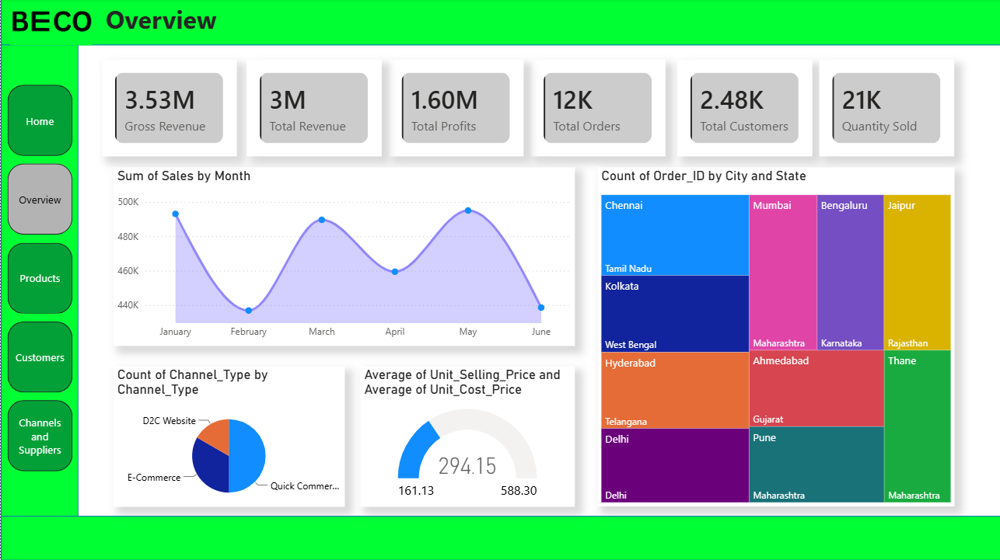
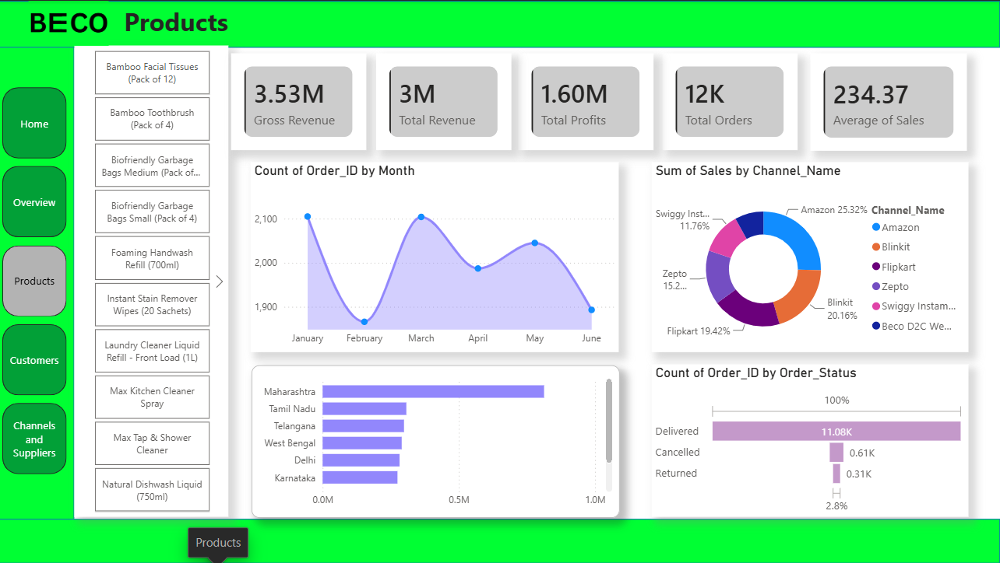
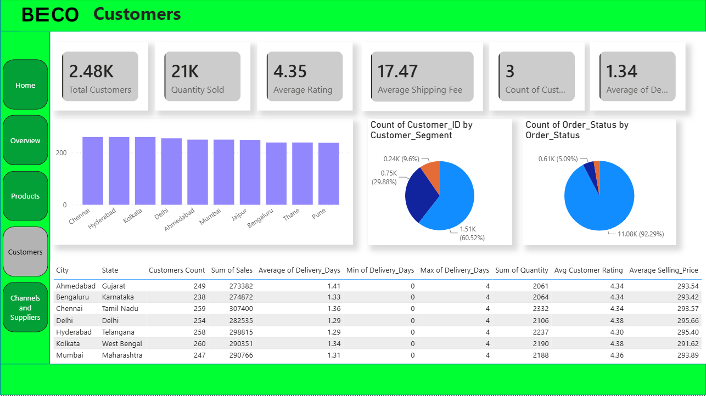
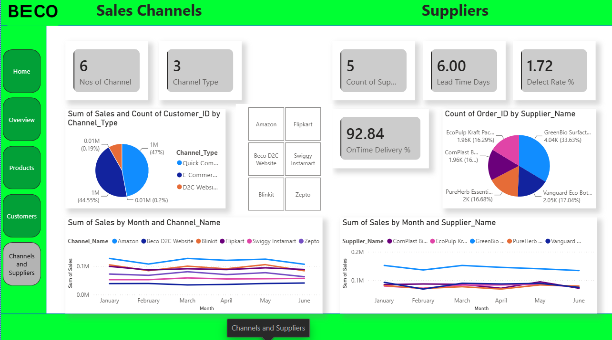
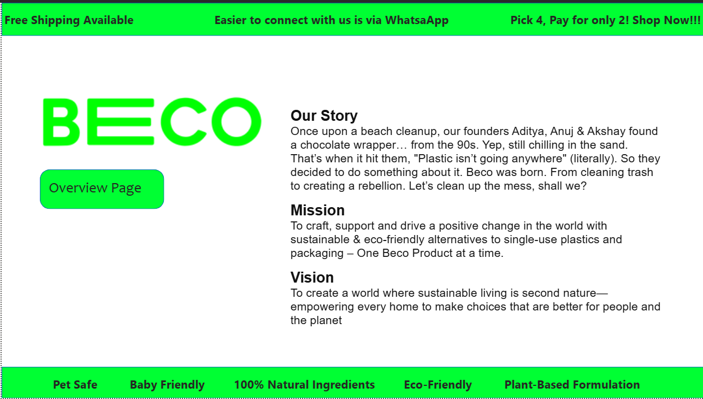

# 🌱 BECO Sales & Business Analytics Dashboard

<p align="center">
  <b>An interactive Power BI dashboard built for BECO to analyze business performance, products, customers, suppliers, and sales channels.</b>
</p>

---

## 📌 Project Overview

The **BECO Sales & Business Analytics Dashboard** is an end-to-end Business Intelligence project developed using **Microsoft Power BI**.

This dashboard transforms raw sales data into meaningful insights that help stakeholders monitor business performance, understand customer behavior, evaluate suppliers, and optimize product sales across multiple channels.

The project consists of multiple interconnected dashboard pages that provide both executive-level KPIs and detailed operational analytics.

---

# 📷 Dashboard Preview

## 🏠 Landing Page

The landing page introduces the BECO brand, mission, vision, and allows users to navigate to the analytics dashboard.


---

## 📊 Overview Dashboard

Provides a complete snapshot of the business with high-level KPIs and sales performance.

**Highlights**

- Gross Revenue
- Total Revenue
- Total Profit
- Total Orders
- Total Customers
- Quantity Sold
- Monthly Sales Trend
- Orders by State
- Sales Channel Distribution
- Selling Price Analysis



---

## 📦 Products Dashboard

Analyze product performance across all categories.

### Features

- Product-wise filtering
- Revenue Analysis
- Monthly Orders
- Sales by Channel
- Orders by Status
- State-wise Sales



---

## 👥 Customers Dashboard

Understand customer behavior and purchasing trends.

### Features

- Customer Count
- Quantity Sold
- Customer Rating
- Shipping Fee
- Customer Segments
- Delivery Analysis
- Customer Table by City & State



---

## 🚚 Channels & Suppliers Dashboard

Track supplier performance and sales channels.

### Features

- Number of Suppliers
- Lead Time
- Defect Rate
- On-Time Delivery %
- Supplier-wise Orders
- Monthly Supplier Performance
- Sales by Channel



---

# 🎯 Objectives

This dashboard was created to answer important business questions such as:

- How much revenue is generated?
- Which products perform the best?
- Which states generate the highest sales?
- Which suppliers perform efficiently?
- Which sales channels contribute the most?
- How many orders are delivered, cancelled, or returned?
- What is the customer distribution across regions?
- How does sales performance change month-over-month?

---

# 📈 Key KPIs

| KPI | Description |
|------|-------------|
| Gross Revenue | Total revenue before deductions |
| Total Revenue | Net revenue generated |
| Total Profit | Overall business profit |
| Total Orders | Number of customer orders |
| Total Customers | Active customer count |
| Quantity Sold | Total products sold |
| Average Selling Price | Average product selling price |
| Average Shipping Fee | Customer shipping cost |
| Average Rating | Customer satisfaction score |
| On-Time Delivery | Supplier delivery performance |

---

# 📊 Dashboard Pages

| Page | Description |
|-------|-------------|
| Home | Company overview and navigation |
| Overview | Executive business summary |
| Products | Product analytics |
| Customers | Customer insights |
| Channels & Suppliers | Supplier and sales channel analytics |

---

# 📌 Insights Generated

### Sales Insights

- Monthly sales trend analysis
- Revenue growth monitoring
- Profit tracking
- Order analysis

### Product Insights

- Best-selling products
- Product demand
- Product revenue contribution
- Order status analysis

### Customer Insights

- Customer segmentation
- Customer distribution by city
- Delivery performance
- Customer ratings

### Supplier Insights

- Supplier contribution
- On-time delivery percentage
- Lead time analysis
- Defect rate monitoring

### Channel Insights

- Sales by Channel
- Channel contribution
- Channel-wise revenue

---

# 🛠 Tools & Technologies

- Microsoft Power BI
- Power Query
- DAX (Data Analysis Expressions)
- Data Modeling
- Interactive Visualizations

---

# 📂 Dashboard Features

- Interactive Filters (Slicers)
- Cross Filtering
- KPI Cards
- Line Charts
- Pie Charts
- Donut Charts
- Tree Maps
- Tables
- Gauge Charts
- Drill-through Navigation
- Multi-page Dashboard

---

# 📁 Project Structure

```
BECO-Sales-Dashboard/
│
├── Dashboard.pbix
├── Dataset/
│   └── Sales_Data.xlsx
├── Images/
│   ├── home.png
│   ├── overview.png
│   ├── products.png
│   ├── customers.png
│   └── channels_suppliers.png
├── README.md
└── LICENSE
```

---

# 🚀 Getting Started

### 1. Clone the Repository

```bash
git clone https://github.com/yourusername/BECO-Sales-Dashboard.git
```

### 2. Open Power BI

Open the `.pbix` file using **Microsoft Power BI Desktop**.

### 3. Refresh Data

If necessary:

- Home
- Refresh

---

# 📊 Dashboard Capabilities

✔ Executive Dashboard

✔ Sales Analysis

✔ Product Analysis

✔ Customer Analytics

✔ Supplier Performance

✔ Sales Channel Analysis

✔ Geographic Insights

✔ Interactive Navigation

---

# 💡 Business Value

This dashboard enables decision-makers to:

- Monitor company performance in real time
- Identify top-performing products
- Improve supplier efficiency
- Understand customer purchasing behavior
- Optimize sales channels
- Support strategic business decisions through data-driven insights

---

# 📸 Screenshots

| Home | Overview |
|------|----------|
|  |  |

| Products | Customers |
|-----------|-----------|
|  |  |

| Channels & Suppliers |
|----------------------|
|  |

---

# 🔮 Future Improvements

- Sales Forecasting
- Customer Churn Prediction
- Inventory Dashboard
- Real-Time Data Integration
- Mobile Optimized Dashboard
- Advanced Drill-through Reports
- AI-powered Insights
- Power BI Service Deployment

---

# ⭐ If you found this project helpful

Please consider giving this repository a **⭐ Star** on GitHub.

It helps others discover the project and motivates future improvements.

---

## 📜 License

This project is licensed under the **MIT License**.

Feel free to use, modify, and share it for educational purposes.

---

<p align="center">
<b>Made with ❤️ using Microsoft Power BI</b>
</p>
